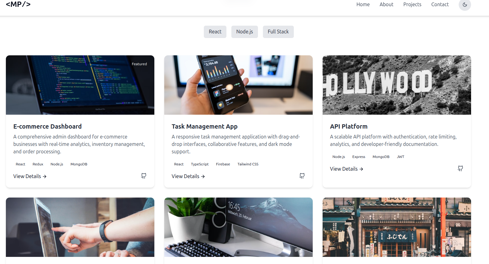

# 🌐 My Portfolio

Welcome to my personal portfolio website! This site showcases my projects, skills, and experience as a developer/designer.

## 🔗 Live Demo

👉 [View Portfolio](https://your-deployed-link.com)

### 🖼️ Preview

## 🧑‍💻 About Me

I'm [Your Name], a passionate [Your Role — e.g., Full-Stack Developer] with experience in building responsive web applications and solving real-world problems through code.

## 🛠️ Tech Stack

- **Frontend**: React.js, HTML5, CSS3, JavaScript, Tailwind CSS / Bootstrap
- **Backend**: Node.js, Express (if applicable)
- **Deployment**: Nginx / Apache, VPS, Docker (if used)
- **Tools**: Git, VS Code, Figma, Postman

## 📁 Project Structure

